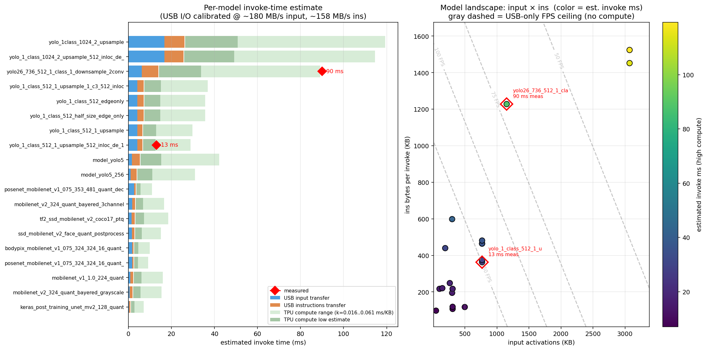

# TFLite model inventory — `/home/bogdan/work/coralmicro/models/`

Generated by `scripts/inspect_all_models.py`. Inspected 24 models.

Columns:

- **File** — total .tflite file size
- **Input** — input tensor shape (NHWC or similar) + dtype
- **Output(s)** — output tensor shape(s)
- **Params (1×)** — weights cached on TPU at load time (from PARAM_CACHING executable; "n/a" when STAND_ALONE)
- **Ins/invoke** — compiled TPU bytecode streamed every invoke (from EXEC_ONLY or STAND_ALONE executable). Dominant USB-I/O cost.
- **Chunks** — number of instruction bitstream chunks the compiler emits (~260 KB cap per chunk)
- **Hints** — dma_hints breakdown (`D`ma desc + `I`nstruction)
- **Input B/invoke** — input activations pushed every invoke (computed from tensor shape × dtype)

| Model | File | Input | Output(s) | Params (1×) | Ins/invoke | Chunks | Hints D/I | Input B/invoke |
|---|---:|---|---|---:|---:|---:|---|---:|
| `bodypix_mobilenet_v1_075_324_324_16_quant_decoder_edgetpu.tflite` | 1601 KB | 1×324×324×3 U8 | 1×20×21×21 F32; 1×20×17×2 F32; 1×20×17 F32; 1×20 F32; ? F32; 1×21×21×1 U8; 1×21×21×24 U8 | 1443 KB | 118 KB | 1 | 7/1 | 307 KB |
| `keras_post_training_unet_mv2_128_quant_edgetpu.tflite` | 6981 KB | 1×128×128×3 U8 | 1×128×128×3 U8 | 6825 KB | 97 KB | 1 | 3/1 | 48 KB |
| `mobilenet_v1_1.0_224_quant_edgetpu.tflite` | 4638 KB | 1×224×224×3 U8 | 1×1001 U8 | 4359 KB | 220 KB | 1 | 2/1 | 147 KB |
| `mobilenet_v2_324_quant_bayered_3channel_edgetpu.tflite` | 4112 KB | 1×324×324×3 U8 | 1×1001 U8 | 3856 KB | 216 KB | 1 | 2/1 | 307 KB |
| `mobilenet_v2_324_quant_bayered_grayscale_edgetpu.tflite` | 4112 KB | 1×324×324×1 U8 | 1×1001 U8 | 3856 KB | 216 KB | 1 | 2/1 | 102 KB |
| `model_yolo5_256_edgetpu.tflite` | 4865 KB | 1×256×256×3 I8 | 1×5×1360 I8 | 4372 KB | 439 KB | 2 | 3/2 | 192 KB |
| `model_yolo5_edgetpu.tflite` | 5062 KB | 1×320×320×3 I8 | 1×5×2125 I8 | 4398 KB | 598 KB | 3 | 6/3 | 300 KB |
| `person_detect_model.tflite` | 293 KB | 1×96×96×1 I8 | 1×2 I8 | *CPU-only* | — | — | — | 9 KB |
| `posenet_mobilenet_v1_075_324_324_16_quant_decoder_edgetpu.tflite` | 1553 KB | 1×324×324×3 U8 | 1×20×17×2 F32; 1×20×17 F32; 1×20 F32; ? F32 | 1410 KB | 106 KB | 1 | 4/1 | 307 KB |
| `posenet_mobilenet_v1_075_353_481_quant_decoder_edgetpu.tflite` | 1509 KB | 1×353×481×3 U8 | 1×10×17×2 F32; 1×10×17 F32; 1×10 F32; ? F32 | 1353 KB | 117 KB | 1 | 4/1 | 497 KB |
| `ssd_mobilenet_v2_face_quant_postprocess_edgetpu.tflite` | 6510 KB | 1×320×320×3 U8 | 1×50×4 F32; 1×50 F32; 1×50 F32; 1 F32 | 5998 KB | 195 KB | 1 | 4/1 | 300 KB |
| `testconv1-edgetpu.tflite` | 36 KB | 1×32×32×3 U8 | 1×30×30×16 U8 | — | 0 KB | 0 | 0/0 | 3 KB |
| `tf2_ssd_mobilenet_v2_coco17_ptq_edgetpu.tflite` | 6911 KB | 1×300×300×3 U8 | 1×20 F32; 1×20×4 F32; 1 F32; 1×20 F32 | 6546 KB | 248 KB | 1 | 3/1 | 263 KB |
| `voice_commands_v0.7_edgetpu.tflite` | 564 KB | 1×198×32 U8 | 1×149 U8 | 475 KB | 57 KB | 1 | 2/1 | 6 KB |
| `yamnet_spectra_in.tflite` | 3952 KB | 1×96×64 F32 | 1×521 F32 | *CPU-only* | — | — | — | 24 KB |
| `yamnet_spectra_in_edgetpu.tflite` | 4040 KB | 1×96×64 F32 | 1×521 F32 | 3948 KB | 58 KB | 1 | 2/1 | 24 KB |
| `yolo26_736_512_1_class_1_downsample_2conv.tflite` | 3221 KB | 1×512×768×3 I8 | 1×5×2016 I8 | 1897 KB | 1228 KB | 5 | 6/5 | 1152 KB |
| `yolo_1_class_1024_2_upsample_512_inloc_de_1024_la_P5_32.tflite` | 6696 KB | 1×1024×1024×3 U8 | 1×1344×6 U8 | 4674 KB | 1452 KB | 6 | 8/6 | 3072 KB |
| `yolo_1_class_512_1_upsample.tflite` | 7468 KB | 1×512×512×3 U8 | 1×1344×6 U8 | 5690 KB | 375 KB | 2 | 5/2 | 768 KB |
| `yolo_1_class_512_1_upsample_1_c3_512_inloc_de_1024_la_P5_32.tflite` | 5600 KB | 1×512×512×3 U8 | 1×1344×6 U8 | 5061 KB | 481 KB | 2 | 20/2 | 768 KB |
| `yolo_1_class_512_1_upsample_512_inloc_de_1024_la_P5_32.tflite` | 5460 KB | 1×512×512×3 U8 | 1×1344×6 U8 | 5041 KB | 362 KB | 2 | 4/2 | 768 KB |
| `yolo_1_class_512_edgeonly.tflite` | 7528 KB | 1×512×512×3 U8 | 1×5376×6 U8 | 6951 KB | 464 KB | 2 | 25/2 | 768 KB |
| `yolo_1_class_512_half_size_edge_only.tflite` | 4712 KB | 1×512×512×3 U8 | 1×5376×6 U8 | 4137 KB | 464 KB | 2 | 25/2 | 768 KB |
| `yolo_1class_1024_2_upsample.tflite` | 8672 KB | 1×1024×1024×3 U8 | 1×5376×6 U8 | 5429 KB | 1524 KB | 6 | 37/6 | 3072 KB |

## Estimated invoke time — image-detector models

Plot: `scripts/plot_model_perf.py` against `models/`.  Only image-input models (NHWC with 3 or 1 channels, spatial ≥32) are shown; audio models (yamnet, voice_commands) are filtered out because their workloads don't scale the same way.

**Calibration** — two real measurements from 2026-04-24 (pure `sentai.tpu.invoke()` loop, no camera, no pipeline):

| Model | Input | Ins | Measured invoke | USB I/O cycles → ms | TPU compute |
|---|---|---:|---:|---:|---:|
| `yolo_1_class_512_..._P5_32` | 512×512×3 U8 | 362 KB | **13 ms** (~76 FPS) | 7.2 ms | ~6 ms |
| `yolo26_768×512_1class` | 512×768×3 I8 | 1228 KB | **90 ms** (~11 FPS) | 15.2 ms | ~75 ms |

From these we derive **effective USB throughput**:

- **~180 MB/s** for input activations path (EHCI QTD-pipelined 36 KB chunks)
- **~158 MB/s** for instructions path
- ~0.3 ms flat overhead for params + output + event

Both throughputs exceed USB HS raw (60 MB/s) because EHCI queues next QTDs while the current one streams — the M7 only waits on the final IOC.  This matches why the manual 2-slot async-pipelined path (`sentai.diag.tpu_async_ins`) does NOT help: hardware already covers that gap.

**Left panel — per-model estimated breakdown** (stacked bars):

- Blue = USB time to upload input activations
- Orange = USB time to upload instructions (re-sent every invoke)
- Light green = TPU compute upper bound (`k_high = 0.061 ms / KB_ins`, yolo26-calibrated)
- Dark green = TPU compute lower bound (`k_low = 0.016 ms / KB_ins`, yolo_1-calibrated)
- Red diamonds = real measurements

The wide green band reflects honest uncertainty: TPU silicon compute is NOT extractable from static `.tflite` fields.  Depth-wise-separable convs (mobilenet) compute *much* faster per ins-byte than dense YOLO convs.  A yolo_1-like model sits near the upper bound; a mobilenet-like model sits near the lower bound.

**Right panel — model landscape** (input KB × ins KB):

- Each dot is one image model, color = high-compute estimate
- Dashed gray contours = **USB-only FPS ceiling** (what FPS would be if compute were zero — a true upper bound on what this board can do for a given input+ins footprint)
- Red-circled = measured points

Actionable reads:

1. **yolo26** sits above the `20 FPS` USB contour but the actual measurement is 11 FPS — the gap is TPU compute, not USB. Moving to OCRAM or multi-EP USB can at best recover the USB slice (~15 ms → ~8 ms best case), i.e. invoke 90 → ~83 ms, fps 11 → ~12.
2. **yolo_1 (362 KB variant)** sits near the `50 FPS` USB contour; measured 76 FPS — wait, that's *above* the USB ceiling? Because USB and compute overlap: the TPU starts executing chunk[k] while chunk[k+1] is still on the wire.  The "USB ms" column sums per-send *M7-visible* latency (what DWT sees), which is already discounted by overlap.
3. **mobilenet / ssd / posenet / bodypix** all sit in the high-FPS zone (small ins + moderate input); an estimate of ~50-80 FPS is realistic for those.
4. **yolo_1class 1024²** and **yolo_1class 1024² + upsample** are the slowest: 3 MB input alone is ~17 ms of USB time, before compute.  Going 1024² → 768² on the same arch would cut ~10 ms off invoke.

**Caveats** — treat the estimate as a planning tool, not a benchmark:
- Compute model is linear in `ins_KB` (simplification); actual silicon compute is FLOP-driven and depends on conv structure
- Only 2 calibration points, so the band is wide on purpose
- Pipeline mode (camera + invoke concurrent) adds 5-10 ms per invoke from SEMC contention — not modeled here (pure invoke only)

## Per-chunk details

### `bodypix_mobilenet_v1_075_324_324_16_quant_decoder_edgetpu.tflite`

- `exe[0]` type=**EXEC_ONLY**  chunks=1  ins_total=118 KB  params=0 KB  hints D/I=7/1
  - chunk bytes: `[121520]`
- `exe[1]` type=**PARAM_CACHING**  chunks=1  ins_total=4 KB  params=1443 KB  hints D/I=1/1
  - chunk bytes: `[4912]`

### `keras_post_training_unet_mv2_128_quant_edgetpu.tflite`

- `exe[0]` type=**EXEC_ONLY**  chunks=1  ins_total=97 KB  params=15 KB  hints D/I=3/1
  - chunk bytes: `[99824]`
- `exe[1]` type=**PARAM_CACHING**  chunks=1  ins_total=10 KB  params=6825 KB  hints D/I=1/1
  - chunk bytes: `[10576]`

### `mobilenet_v1_1.0_224_quant_edgetpu.tflite`

- `exe[0]` type=**EXEC_ONLY**  chunks=1  ins_total=220 KB  params=0 KB  hints D/I=2/1
  - chunk bytes: `[225824]`
- `exe[1]` type=**PARAM_CACHING**  chunks=1  ins_total=7 KB  params=4359 KB  hints D/I=1/1
  - chunk bytes: `[7248]`

### `mobilenet_v2_324_quant_bayered_3channel_edgetpu.tflite`

- `exe[0]` type=**EXEC_ONLY**  chunks=1  ins_total=216 KB  params=0 KB  hints D/I=2/1
  - chunk bytes: `[222064]`
- `exe[1]` type=**PARAM_CACHING**  chunks=1  ins_total=9 KB  params=3856 KB  hints D/I=1/1
  - chunk bytes: `[9776]`

### `mobilenet_v2_324_quant_bayered_grayscale_edgetpu.tflite`

- `exe[0]` type=**EXEC_ONLY**  chunks=1  ins_total=216 KB  params=0 KB  hints D/I=2/1
  - chunk bytes: `[222064]`
- `exe[1]` type=**PARAM_CACHING**  chunks=1  ins_total=9 KB  params=3856 KB  hints D/I=1/1
  - chunk bytes: `[9776]`

### `model_yolo5_256_edgetpu.tflite`

- `exe[0]` type=**EXEC_ONLY**  chunks=2  ins_total=439 KB  params=8 KB  hints D/I=3/2
  - chunk bytes: `[262176, 188096]`
- `exe[1]` type=**PARAM_CACHING**  chunks=1  ins_total=15 KB  params=4372 KB  hints D/I=1/1
  - chunk bytes: `[15408]`

### `model_yolo5_edgetpu.tflite`

- `exe[0]` type=**EXEC_ONLY**  chunks=3  ins_total=598 KB  params=0 KB  hints D/I=6/3
  - chunk bytes: `[262000, 242720, 108000]`
- `exe[1]` type=**PARAM_CACHING**  chunks=1  ins_total=14 KB  params=4398 KB  hints D/I=1/1
  - chunk bytes: `[14896]`

### `posenet_mobilenet_v1_075_324_324_16_quant_decoder_edgetpu.tflite`

- `exe[0]` type=**EXEC_ONLY**  chunks=1  ins_total=106 KB  params=0 KB  hints D/I=4/1
  - chunk bytes: `[109504]`
- `exe[1]` type=**PARAM_CACHING**  chunks=1  ins_total=4 KB  params=1410 KB  hints D/I=1/1
  - chunk bytes: `[4528]`

### `posenet_mobilenet_v1_075_353_481_quant_decoder_edgetpu.tflite`

- `exe[0]` type=**EXEC_ONLY**  chunks=1  ins_total=117 KB  params=0 KB  hints D/I=4/1
  - chunk bytes: `[120176]`
- `exe[1]` type=**PARAM_CACHING**  chunks=1  ins_total=4 KB  params=1353 KB  hints D/I=1/1
  - chunk bytes: `[4912]`

### `ssd_mobilenet_v2_face_quant_postprocess_edgetpu.tflite`

- `exe[0]` type=**EXEC_ONLY**  chunks=1  ins_total=195 KB  params=192 KB  hints D/I=4/1
  - chunk bytes: `[199776]`
- `exe[1]` type=**PARAM_CACHING**  chunks=1  ins_total=9 KB  params=5998 KB  hints D/I=1/1
  - chunk bytes: `[9808]`

### `testconv1-edgetpu.tflite`

- `exe[0]` type=**?None**  chunks=1  ins_total=15 KB  params=0 KB  hints D/I=3/1
  - chunk bytes: `[15984]`

### `tf2_ssd_mobilenet_v2_coco17_ptq_edgetpu.tflite`

- `exe[0]` type=**EXEC_ONLY**  chunks=1  ins_total=248 KB  params=0 KB  hints D/I=3/1
  - chunk bytes: `[254304]`
- `exe[1]` type=**PARAM_CACHING**  chunks=1  ins_total=10 KB  params=6546 KB  hints D/I=1/1
  - chunk bytes: `[10448]`

### `voice_commands_v0.7_edgetpu.tflite`

- `exe[0]` type=**EXEC_ONLY**  chunks=1  ins_total=57 KB  params=0 KB  hints D/I=2/1
  - chunk bytes: `[58896]`
- `exe[1]` type=**PARAM_CACHING**  chunks=1  ins_total=4 KB  params=475 KB  hints D/I=1/1
  - chunk bytes: `[4144]`

### `yamnet_spectra_in_edgetpu.tflite`

- `exe[0]` type=**EXEC_ONLY**  chunks=1  ins_total=58 KB  params=0 KB  hints D/I=2/1
  - chunk bytes: `[59664]`
- `exe[1]` type=**PARAM_CACHING**  chunks=1  ins_total=5 KB  params=3948 KB  hints D/I=1/1
  - chunk bytes: `[5552]`

### `yolo26_736_512_1_class_1_downsample_2conv.tflite`

- `exe[0]` type=**EXEC_ONLY**  chunks=5  ins_total=1228 KB  params=23 KB  hints D/I=6/5
  - chunk bytes: `[261680, 262080, 262176, 261568, 209968]`
- `exe[1]` type=**PARAM_CACHING**  chunks=1  ins_total=41 KB  params=1897 KB  hints D/I=1/1
  - chunk bytes: `[42672]`

### `yolo_1_class_1024_2_upsample_512_inloc_de_1024_la_P5_32.tflite`

- `exe[0]` type=**EXEC_ONLY**  chunks=6  ins_total=1452 KB  params=514 KB  hints D/I=8/6
  - chunk bytes: `[260960, 262144, 261936, 262144, 261968, 177840]`
- `exe[1]` type=**PARAM_CACHING**  chunks=1  ins_total=6 KB  params=4674 KB  hints D/I=1/1
  - chunk bytes: `[6576]`

### `yolo_1_class_512_1_upsample.tflite`

- `exe[0]` type=**EXEC_ONLY**  chunks=2  ins_total=375 KB  params=1354 KB  hints D/I=5/2
  - chunk bytes: `[261872, 122144]`
- `exe[1]` type=**PARAM_CACHING**  chunks=1  ins_total=5 KB  params=5690 KB  hints D/I=1/1
  - chunk bytes: `[5552]`

### `yolo_1_class_512_1_upsample_1_c3_512_inloc_de_1024_la_P5_32.tflite`

- `exe[0]` type=**EXEC_ONLY**  chunks=2  ins_total=481 KB  params=2 KB  hints D/I=20/2
  - chunk bytes: `[261120, 231616]`
- `exe[1]` type=**PARAM_CACHING**  chunks=1  ins_total=9 KB  params=5061 KB  hints D/I=1/1
  - chunk bytes: `[10160]`

### `yolo_1_class_512_1_upsample_512_inloc_de_1024_la_P5_32.tflite`

- `exe[0]` type=**EXEC_ONLY**  chunks=2  ins_total=362 KB  params=2 KB  hints D/I=4/2
  - chunk bytes: `[261232, 110432]`
- `exe[1]` type=**PARAM_CACHING**  chunks=1  ins_total=9 KB  params=5041 KB  hints D/I=1/1
  - chunk bytes: `[9520]`

### `yolo_1_class_512_edgeonly.tflite`

- `exe[0]` type=**EXEC_ONLY**  chunks=2  ins_total=464 KB  params=10 KB  hints D/I=25/2
  - chunk bytes: `[262112, 213664]`
- `exe[1]` type=**PARAM_CACHING**  chunks=1  ins_total=9 KB  params=6951 KB  hints D/I=1/1
  - chunk bytes: `[9776]`

### `yolo_1_class_512_half_size_edge_only.tflite`

- `exe[0]` type=**EXEC_ONLY**  chunks=2  ins_total=464 KB  params=10 KB  hints D/I=25/2
  - chunk bytes: `[262112, 213408]`
- `exe[1]` type=**PARAM_CACHING**  chunks=1  ins_total=9 KB  params=4137 KB  hints D/I=1/1
  - chunk bytes: `[9264]`

### `yolo_1class_1024_2_upsample.tflite`

- `exe[0]` type=**EXEC_ONLY**  chunks=6  ins_total=1524 KB  params=1623 KB  hints D/I=37/6
  - chunk bytes: `[261520, 259440, 261632, 261696, 262080, 254240]`
- `exe[1]` type=**PARAM_CACHING**  chunks=1  ins_total=5 KB  params=5429 KB  hints D/I=1/1
  - chunk bytes: `[5552]`

